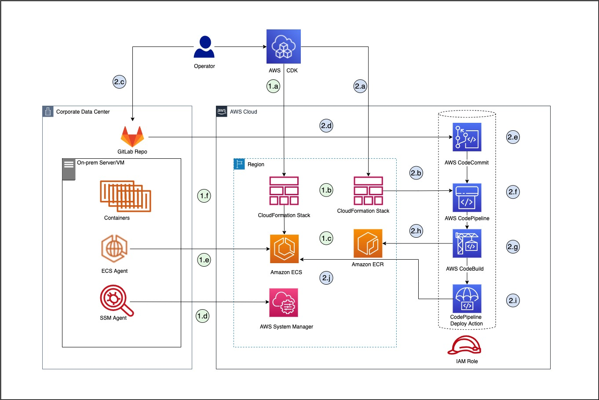

# Amazon ECS Anywhere CDK Samples
[Amazon Elastic Container Service (ECS) Anywhere](https://aws.amazon.com/ecs/anywhere/) enables customers to easily run and manage container workloads on customer-managed infrastructure like Physical or Virtual Machines (VM). It provides a consistent tooling and API experience across your container-based applications. ECS Anywhere helps customer to reduce infrastructure and operational cost, also mitigate the complex local container orchestration. It ensures compliance requirements and provide scalability using your existing on-premise investments. 

 This sample code demonstrates the step by step approach to provision ECS Anywhere cluster by using [AWS Cloud Development Kit v2 (AWS CDK)](https://aws.amazon.com/cdk/) stacks. Then it setup a CI/CD Pipeline using [AWS CodePipeline](https://aws.amazon.com/codepipeline/) service. Additionally, it shows how you can replicate [GitLab code repository](https://docs.gitlab.com/ee/user/project/repository/) to [AWS CodeCommit](https://aws.amazon.com/codecommit/) and deploy your containerised application on ECS Anywhere cluster. 

This sample code can be beneficial to the customers who are already running their container applications using on-premise infrastructure and controlling codebase using GitLab repositories, but now want to manage their workload using AWS Cloud services without disturbing and sacrificing existing on-premise infrastructure.

## Target architecture 



## Prerequisites 

1. An active AWS account

2. AWS Command Line Interface (AWS CLI), installed and configured. For more information about this, see [Installing, updating, and uninstalling the AWS CLI in the AWS CLI](https://docs.aws.amazon.com/cli/latest/userguide/getting-started-install.html) documentation. 

3. AWS Cloud Development Kit (AWS CDK) Toolkit, installed and configured. For more information about this, see [AWS CDK Toolkit (cdk command)](https://docs.aws.amazon.com/cdk/latest/guide/cli.html) in the AWS CDK documentation.

4. Node package manager (npm), installed and configured for CDK Typescript. For more information about this, see [Downloading and installing Node.js and npm](https://docs.npmjs.com/downloading-and-installing-node-js-and-npm) in the npm documentation.

## Deployment Steps

### 1. Build and deploy CDK ECS Anywhere Infrastructure Stack

1.1. Install the package dependencies and compile the TypeScript files by running the following commands:

```
$cd EcsAnywhereCdk

$npm install

$npm fund
```
1.2. To build the project code, run the command:

```
npm run build
```
For more information about building and deploying the project, see [Your first AWS CDK app in the AWS CDK](https://docs.aws.amazon.com/cdk/latest/guide/hello_world.html#:~:text=the%20third%20parameter.-,Synthesize%20an%20AWS%20CloudFormation%20template,-Synthesize%20an%20AWS) documentation.

1.3. To list the stacks, run the command:

```
$cdk list
```    
To deploy the project code, run the command:
```
$cdk  deploy EcsAnywhereInfraStack
```
1.4. Open the AWS CloudFormation console at https://console.aws.amazon.com/cloudformation, and choose the EcsAnywhereInfraStack stack. 

<br />

#### **Please note** : *It would take sometime to setup ECS cluster meanwhile follow next steps.*

<br />

### 2. Set up an on-premises machine

2.1.  For demonstration purposes, you can use [Vagrant](https://www.vagrantup.com/) to create a VM. Vagrant is an open-source utility for building and maintaining portable virtual software development environments. Create a Vagrant VM by running the vagrant up command from the root directory where Vagrantfile is placed. For more information, see the [Vagrant documentation](https://www.vagrantup.com/docs/cli/up).

2.2.  Install AWS CLI by following [AWS CLI installation](https://docs.aws.amazon.com/cli/latest/userguide/getting-started-install.html) instructions and run following commands on VM. 

2.3. Create an activation code and ID that you can use to register your VM with AWS Systems Manager and to activate your external instance. The output from this command includes ActivationId and ActivationCode values: 

```
aws ssm create-activation --iam-role EcsAnywhereInstanceRole | tee ssm-activation.json
```

2.4. Export the activation ID and code values
```
export ACTIVATION_ID=<activation-ID>

export ACTIVATION_CODE=<activation-code>
```
2.5. Download the installation script to your on-premises server or VM
```
curl --proto "https" -o "ecs-anywhere-install.sh" "https://amazon-ecs-agent.s3.amazonaws.com/ecs-anywhere-install-latest.sh"
```
2.6. Run the installation script on your on-premises server or VM
```
sudo bash ecs-anywhere-install.sh \
    --cluster EcsAnywhereCluster \
    --activation-id $ACTIVATION_ID \
    --activation-code $ACTIVATION_CODE \
    --region <region-name>`
 ```

For more information about setting up and registering your VM, see [Registering an external instance to a cluster](https://docs.amazonaws.cn/en_us/AmazonECS/latest/developerguide/ecs-anywhere-registration.html) in the Amazon ECS documentation. If you face any issue, please see Troubleshooting section as below. 

### 3. Setup replication between GitLab and CodeCommit Repos and Deploy CICD Pipeline Stack.

3.1. Create 'main' branch on AWS CodeCommit repo by creating the first commit for a repository. You can follow AWS documentation to Create a commit in AWS CodeCommit. Below command given for reference:

 ```
aws codecommit put-file \
    --repository-name EcsAnywhereRepo \
    --branch-name main \
    --file-path README.md \
    --file-content "Test" \
    --name "Dev Ops" \
    --email "devops@example.com" \
    --commit-message "Adding README."
 ```

3.2. You can mirror a GitLab repository to and from external sources. You can select which repository serves as the source. Branches, tags, and commits are synced automatically. Setup [GitLab mirroring using GitLab repository mirroring](https://docs.gitlab.com/ee/user/project/repository/mirror/) documentation. Once setup, you can update a mirror manually so it would replicate code from GitLab repo to AWS CodeCommit.

3.3. To deploy the CICD project code, run the command:

```
$cdk  deploy EcsAnywherePipelineStack
```

3.4. To test the CICD Pipeline, you can make application code changes and push it to source on-prem GitLab repo. For more information, refer [GitLab push](https://docs.gitlab.com/ee/user/project/push_options.html) documentation. For instance, edit  `../application/index.html`  file to update value of "App Version" 

3.5. A repository mirror at GitLab updates automatically or can also manually trigger. For more details, refer [update a GitLab mirror](https://docs.gitlab.com/ee/user/project/repository/mirror/#update-a-mirror). 

3.6. After replication the code, it would merge to AWS CodeCommit repo which triggers CICD Pipeline result.

### 4. Clean up
4.1. After you walk through this sample code, you should remove the resources you created to avoid incurring any further charges. To clean up, run the command:

```
$cdk destroy EcsAnywherePipelineStack

$cdk destroy EcsAnywhereInfraStack
```


## Security

See [CONTRIBUTING](CONTRIBUTING.md#security-issue-notifications) for more information.


## License

This library is licensed under the MIT-0 License. See the LICENSE file.

